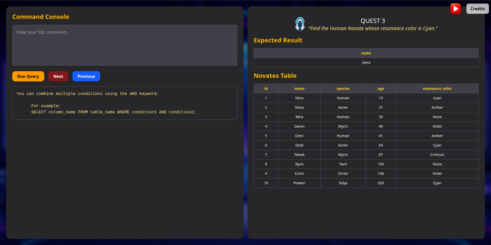
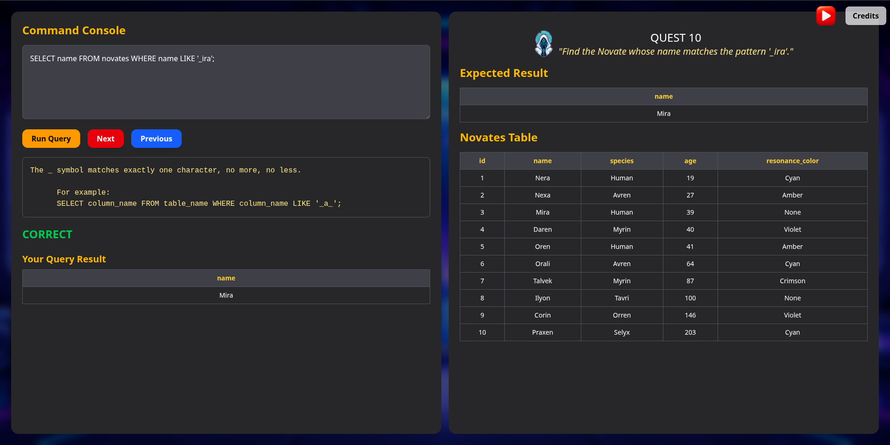
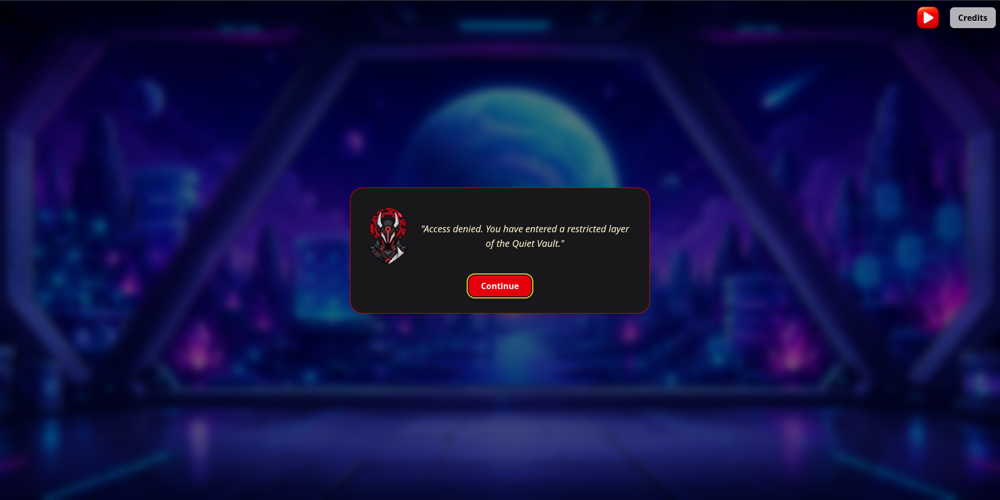
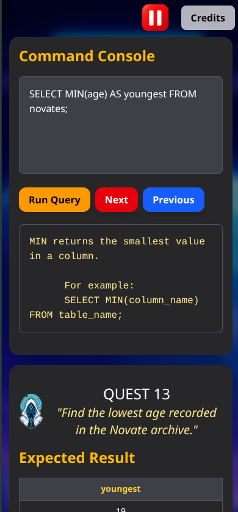
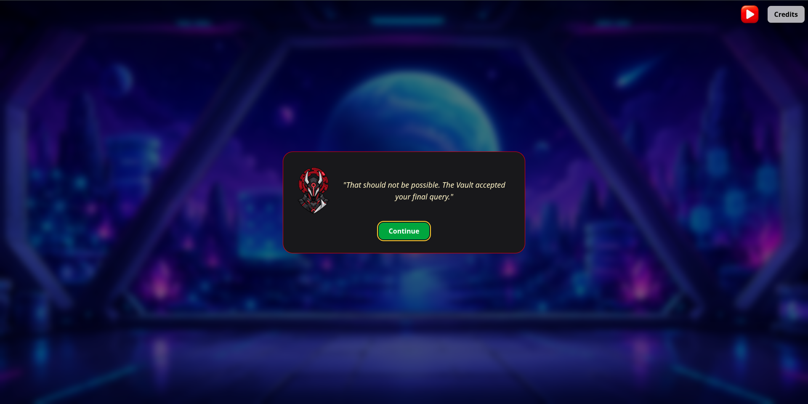

# TheSQLorian

> A cinematic sci-fi SQL learning game powered by SQLite and WebAssembly in the browser.

TheSQLorian is an interactive SQL learning experience set in an original sci-fi universe.

Players progress through a series of SQL challenges while exploring the Axiom Institute, interacting with its characters, and querying data from the `novates` database.

Unlike exercises that validate answers by comparing SQL strings, TheSQLorian evaluates queries by their **behavior**. User queries are executed against both the visible dataset and deterministic hidden validation datasets, helping detect solutions that only happen to produce the expected visible result.

The entire application runs client-side: SQLite is powered by `sql.js` and WebAssembly directly in the browser, with no backend or external database required.

## Key Features

- **19 progressive SQL challenges** covering filtering, logical operators, pattern matching, aggregate functions, sorting, limiting, and grouping.
- **Behavioral SQL validation** instead of exact query-string matching.
- **Deterministic hidden validation datasets** that help reject hard-coded or coincidentally correct queries.
- **SQLite in the browser** through `sql.js` and WebAssembly.
- **Fresh database execution** for query evaluation to avoid shared mutable database state.
- **Persistent game progress** using versioned and normalized `localStorage` data.
- **Original sci-fi universe** with custom characters, terminology, artwork, story dialogues, and environments.
- **Responsive and keyboard-accessible interface** with modal focus management and accessible dynamic feedback.
- **Automated test coverage** for SQL validation, behavioral evaluation, challenge integrity, and progress persistence.

## Screenshots

### SQL Challenge Interface



### Successful Query



### Story Introduction



### Mobile Layout



### Completion



## How It Works

Each challenge presents the player with:

- a SQL task
- a hint
- the available `novates` table
- the expected result

The player writes a SQL query directly in the browser and runs it through the in-browser SQLite engine.

A correct solution unlocks the next challenge. Completed challenges and the current challenge are persisted locally, so progress survives page reloads.

The game currently focuses on single-statement `SELECT` queries and progressively introduces concepts such as:

- comparison operators
- `AND` / `OR`
- `IN`
- `DISTINCT`
- `LIKE`
- aggregate functions
- `ORDER BY`
- `LIMIT`
- `GROUP BY`

## SQL Validation Architecture

TheSQLorian does not validate an answer by comparing the player's SQL text with a predefined solution.

Instead, the player's query is evaluated by its **result behavior**.

```text
Player SQL
    ↓
Statement validation
    ↓
Execute on a fresh SQLite database
    ↓
Compare with reference query result
    ↓
Repeat against deterministic validation datasets
    ↓
Correct / Incorrect
```

### 1. Statement validation

Before execution, the submitted SQL is checked against the rules supported by the current learning experience.

The validator accepts a single `SELECT` statement and rejects unsupported or multiple statements.

This keeps the execution model intentionally narrow while still allowing different valid SQL expressions to solve the same task.

### 2. Fresh database execution

Queries are executed against a newly created SQLite database rather than sharing one mutable database instance between evaluations.

This prevents one query execution from accidentally affecting later evaluations and keeps validation deterministic.

### 3. Reference-query comparison

Each challenge has a canonical reference query used as the behavioral oracle.

The player's result is compared with the reference result instead of comparing the SQL source strings.

Depending on the challenge, comparison can account for properties such as:

- row count
- duplicate rows
- column names
- row ordering

For example, ordering is significant in challenges where `ORDER BY` is part of the expected behavior.

### 4. Deterministic validation datasets

A query that produces the correct result on one visible dataset can still be logically wrong.

To reduce these false positives, TheSQLorian evaluates successful-looking queries against additional deterministic datasets that are not shown in the game interface.

A query must continue to behave like the reference query across those datasets before the challenge is accepted.

These datasets are designed to expose common accidental correlations, boundary mistakes, hard-coded values, and overly specific solutions.

> This is pragmatic behavioral validation, not a formal proof that two arbitrary SQL queries are mathematically equivalent.

### 5. Visible result feedback

Only the result produced from the visible game dataset is shown to the player.

Validation results from the additional datasets are used internally and are not exposed through the interface.

## Tech Stack

| Technology | Role |
| --- | --- |
| React 19 | UI and game state |
| Vite | Development server and production build tooling |
| Tailwind CSS 4 | Styling and responsive layout |
| sql.js | SQLite compiled to WebAssembly for browser execution |
| SQLite | SQL execution engine |
| Vitest | Automated testing |
| localStorage | Client-side progress persistence |

No backend, API server, or external database is required to run the game.

## Application Architecture

TheSQLorian is a fully client-side application.

```text
React UI
   │
   ├── Story / challenge progression
   ├── Progress persistence
   ├── SQL editor and result display
   │
   ▼
SQL Evaluation Layer
   │
   ├── Statement validation
   ├── Fresh database creation
   ├── Reference-query execution
   ├── Result comparison
   └── Behavioral validation datasets
   │
   ▼
sql.js
   │
   ▼
SQLite WebAssembly
   │
   ▼
Browser memory
```

The SQLite database is created in memory in the browser. It is used for query evaluation and does not need to be persisted between sessions.

Game progress is stored separately in `localStorage`.

This separation keeps SQL execution disposable while allowing challenge progression to survive page reloads.

### Progress persistence

Progress is stored using a versioned structure containing:

```js
{
  version,
  currentChallengeIndex,
  completedChallengeIndexes
}
```

Stored data is normalized when loaded so malformed, duplicated, outdated, or out-of-range values do not break the game.

SQL drafts, query results, validation errors, and transient correctness state are intentionally not persisted.

## Getting Started

### Prerequisites

- Node.js
- npm

### Installation

Clone the repository:

```bash
git clone https://github.com/malvin-hoxha/thesqlorian.git
cd thesqlorian
```

Install dependencies:

```bash
npm install
```

Start the development server:

```bash
npm run dev
```

Vite will print the local development URL in the terminal.

No database setup, environment variables, API keys, or backend services are required.

## Available Scripts

- `npm run dev` — starts the Vite development server
- `npm run test` — runs the Vitest test suite once
- `npm run test:watch` — runs Vitest in watch mode
- `npm run lint` — runs ESLint across the project
- `npm run build` — creates the production build
- `npm run preview` — serves the production build locally for verification

## Project Structure

```text
thesqlorian/
├── public/
│   ├── background.png
│   ├── database-icon.png
│   ├── merox.png
│   ├── mnema.png
│   └── music.mp3
│
├── src/
│   ├── assets/
│   │   ├── play_icon.png
│   │   └── pause_icon.png
│   │
│   ├── components/
│   │   ├── StoryIntro.jsx
│   │   ├── LeftAside.jsx
│   │   ├── RightAside.jsx
│   │   ├── IntroDialogue.jsx
│   │   ├── QuestsDialogues.jsx
│   │   ├── OutroDialogue.jsx
│   │   └── Credits.jsx
│   │
│   ├── data/
│   │   ├── data.js
│   │   ├── table.js
│   │   └── validationDatasets.js
│   │
│   ├── lib/
│   │   ├── sql/
│   │   │   ├── validateSqlStatement.js
│   │   │   ├── evaluateQuery.js
│   │   │   ├── compareSqlResults.js
│   │   │   ├── executeQueryOnFreshDatabase.js
│   │   │   └── createNovatesDatabase.js
│   │   │
│   │   ├── progressStorage.js
│   │   └── useDialogFocus.js
│   │
│   ├── App.jsx
│   ├── main.jsx
│   └── index.css
│
├── package.json
├── vite.config.js
└── README.md
```

The application intentionally separates:

- **UI and game flow** in `components/`
- **challenge and validation data** in `data/`
- **SQL evaluation logic** in `lib/sql/`
- **progress persistence and reusable UI behavior** in `lib/`

This keeps the core SQL validation logic independent from the React interface and easier to test.

## Challenge Coverage

The current game contains 19 challenges that progressively introduce core SQL concepts.

| Topic | Concepts |
| --- | --- |
| Filtering | `WHERE`, comparison operators |
| Logical conditions | `AND`, `OR` |
| Set membership | `IN` |
| Unique values | `DISTINCT` |
| Pattern matching | `LIKE`, `%`, `_` |
| Aggregation | `AVG`, `MAX`, `MIN`, `SUM`, `COUNT` |
| Sorting | `ORDER BY` |
| Limiting results | `LIMIT` |
| Grouping | `GROUP BY` |

The current curriculum intentionally focuses on foundational single-table querying.

Advanced topics such as joins, subqueries, CTEs, window functions, schema modification, and multi-statement SQL are outside the current scope.

## Testing

TheSQLorian uses Vitest for automated validation of the application's core behavior.

The test suite covers areas including:

- SQL statement validation
- result comparison
- ordered and unordered result behavior
- duplicate-row handling
- fresh SQLite database execution
- behavioral validation datasets
- canonical challenge queries
- adversarial and incorrect-query cases
- challenge data integrity
- progress normalization and persistence
- corrupted or unavailable browser storage

The behavioral validation suite also verifies that queries which accidentally match the visible expected result can still be rejected when they fail against additional deterministic datasets.

Run the complete test suite with:

```bash
npm run test
```

## Accessibility and Responsive Design

The interface includes accessibility and responsive behavior intended to keep the game usable across keyboard, mobile, and desktop workflows.

Implemented improvements include:

- accessible labels for the SQL editor and interactive controls
- keyboard-visible focus states
- semantic dialog roles and accessible dialog names
- focus containment and restoration for modal dialogues
- dynamic announcements for SQL feedback and errors
- disabled navigation when an action is unavailable
- horizontally scrollable data tables on narrow screens
- responsive control wrapping and panel spacing

The desktop experience preserves the two-panel SQL workspace while smaller screens use a stacked layout.

## Design Decisions and Current Limitations

TheSQLorian deliberately keeps several architectural constraints small and explicit.

### Fully client-side execution

There is no backend or remote database.

This keeps the project easy to run and deploy, but it also means that application code and validation datasets are ultimately available to users through the downloaded client bundle.

The additional validation datasets should therefore be understood as **hidden from the normal game interface**, not as secret or security-protected data.

### Behavioral validation is finite

The validation engine checks query behavior against multiple deterministic datasets.

This significantly improves on exact SQL-string matching and catches many coincidental solutions, but it does not provide formal proof that two arbitrary SQL queries are semantically equivalent for every possible database state.

### Single-statement SELECT scope

The current learning experience intentionally supports a constrained subset centered around single `SELECT` statements.

CTEs, mutation queries, schema changes, and multi-statement submissions are outside the current curriculum.

### Local progress only

Progress is stored in the browser using `localStorage`.

There are currently no user accounts, cloud synchronization, or cross-device progress features.

## Credits

TheSQLorian was created by [Malvin Hoxha](https://github.com/malvin-hoxha).

### Music

Music by **Luis Humanoide**, sourced from Pixabay.

### Visual assets

Project-specific visual assets and third-party media licensing boundaries are documented in [ASSETS.md](ASSETS.md).

## Live Demo

A public live demo will be added with the production deployment.

Until then, the project can be run locally using the instructions above.

## Author

**Malvin Hoxha**

GitHub: [github.com/malvin-hoxha](https://github.com/malvin-hoxha)

## License

The source code is licensed under the [MIT License](LICENSE).

Project-specific visual assets and third-party media are not necessarily covered by the MIT source-code license. See [ASSETS.md](ASSETS.md) for asset and media licensing notes.
